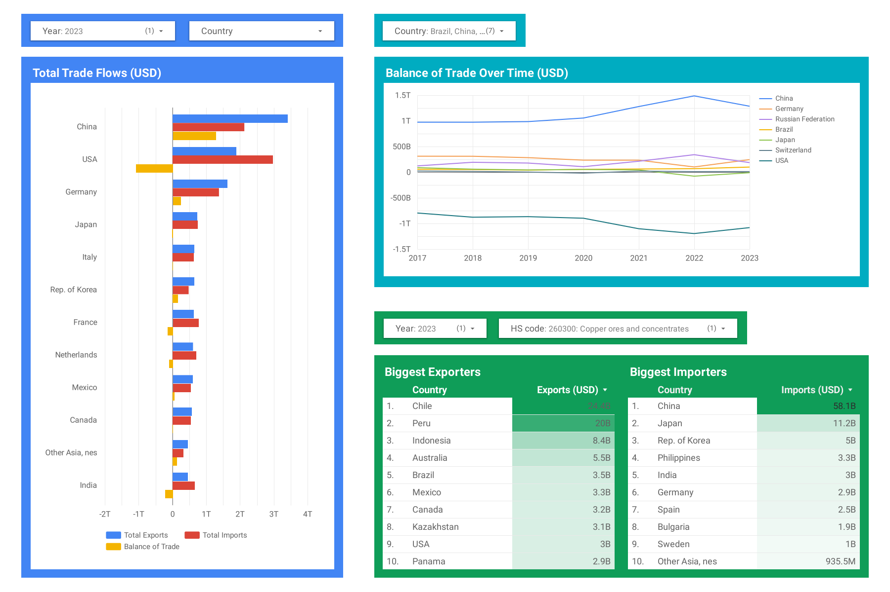

# Trade Flows Analysis Pipeline
## Introduction
This repository contains a data pipeline for ingesting and analysing trade data contained in the BACI database, which is maintained by [CEPII](https://www.cepii.fr/CEPII/en/bdd_modele/bdd_modele_item.asp?id=37). This repository has been created for the purpose of being submitted as project for the [Data Engineering Zoomcamp](https://github.com/DataTalksClub/data-engineering-zoomcamp).

## Project goal
The goal of this project is to analyze trade flows between countries, specifically the trade of goods. The BACI database contains data on bilateral trade flows for 200 countries at the product level, classified according to the "Harmonized System" (HS) nomenclature.
This project focuses on analysing two aspects of trade:
1. The total value of goods exported and imported by a country in a given year, as well as the corresponding balance of trade (calculated as the value of exports minus the value of imports). Negative balances of trade are referred to as trade deficits.
2. The total value of goods exported and imported per country for a given HS code, in order to identify the most important exporters and importers of a given category of goods.
Note that services are not included in the trade data, therefore their value is not considered at any point in this project. Therefore the balance of trade reflects only the balance of trade of goods.

## Infrastructure/Tech Stack
- This project was developed and run entirely in the cloud, by using a Google Cloud Virtual Machine (VM).
- The pipeline uses a Google Cloud Storage bucket, a BigQuery dataset, and a Dataproc cluster to run PySpark
- Terraform is used to setup these three resources
- Looker Studio was used for analysing the dataset stored in BigQuery

Note: due to time constraints, and the fact that the pipeline needs to be run only once a year, no orchestrator such as Airflow or Kestra was used for this project. The whole pipeline can be run by calling one script, as described in the next section.

## Pipeline
As the BACI database is updated once a year, this project uses a batch workflow. The pipeline consists of the following steps:
  1. The infrastructure is setup using Terraform (init, plan, apply).
  2. The latest data available is downloaded from the BACI webpage for the specified HS code. This step handles automatically situations where the URL of the data file might be different due to a new version having been uploaded. The downloaded data consists of a zip file.
  3. The downloaded zip file is unzipped, and the extracted csv files are uploaded to a Google Cloud Storage bucket.
  4. The data contained in the csv files is converted to the parquet format using PySpark on a Dataproc cluster, and the resulting parquet files are saved in the bucket. During this step, the schema is defined and the year is used as partition when creating the parquet files. The year was chosen as partitioning variable since the data is analyzed year-by-year. The following fields are contained in the data in the parquet files:
     - year
     - exporter
     - importer
     - product
     - value
     - quantity
  5. Using PySpark on a Dataproc cluster, the parquet files are read and the total trade values by country are calculated, and subsequently, the balance of trade is calculated. The country codes and product codes are replaced by human-readable values before the dataframe is stored in a table in a BigQuery dataset. The table is named trade_summary_per_country and contains the following fields:
     - year
     - total_exported_value
     - total_imported_value
     - trade_deficit
     - country
  6. Using PySpark on a Dataproc cluster, the parquet files are read and the total trade values by country and by HS code are calculated. The country codes and product codes are replaced by human-readable values before the dataframe is stored in a table in a BigQuery dataset. The table is named trade_by_hs_code and contains the following fields:
     - year
     - total_exported_value
     - total_imported_value
     - country
     - HS_code
  7. The dataset was analysed in Looker Studio. The resulting dashboard can be viewed [here](https://lookerstudio.google.com/s/kkizcMmVhBE), and a screenshot is shown below.




### How to run the pipeline
Follow the instructions in the Setup section.

Once the Google project and different needed tools are setup, in a bash shell, `cd` to the folder `trade-flows-analysis\scripts` and execute the following command:
```
bash pipeline.sh HS17
```
The argument provided is the name of the version of the HS classification system for which to download and analyze the data. 

While the pipeline can be run on other HS versions that are available in the BACI database, it is recommended to use HS17 as it contains data for several of the most recent years. Refer to the Notes at end of this page for more information about the differences between the HS versions.

Once the pipeline has finished, the BigQuery dataset will contain two tables containing the total trade values and the trade values per HS code.

Run terraform destroy when you no longer need to run any part of the pipeline and want to remove the data. If you want to keep the data for longer, but without running any part of the pipeline, stop the virtual machines and the Dataproc cluster via the Google Cloud Console.

## Requirements
To run the pipeline of this project, you need an account on Google Cloud Platform (GCP) with credits (the cost is less than 5 USD per run).

## Setup
In case you would like to run the data pipeline, follow the steps described below to setup the various things needed.
### Google Cloud Platform
1. On GCP, create a new project and select it.
2. Create a service account and assign the "Storage Admin", "BigQuery Admin", "Compute Admin", and "Dataproc Administrator" roles to it. To keep things simple, only one service account is created for the purpose of this project.
3. Create a JSON key for that account
4. Enable the Dataproc API. All other needed APIs should be enabled by default.

### Virtual machine (optional)
This project was setup and run from a GCP virtual machine. In case you would like to also setup a virtual machine and use it to execute the pipeline, follow the instructions below. 
Alternatively, you may run the pipeline on your local machine, provided that you have Bash and the tools described in the other sections installed.
1. To be able to connect to the virtual machine, you first need to generate an SSH key. Follow the instructions provided on this [Google Cloud documentation page](https://cloud.google.com/compute/docs/connect/create-ssh-keys#create_an_ssh_key_pair) to generate one. A public key will be created as well.
2. On GCP, enable the Compute Engine API and go to the Metadata setting page in Compute Engine
3. Select the SSH Keys tab, add the ***public*** SSH key that was generated and save it
4. Go to VM instances and create a VM instance. Select a region located near your location. For the machine type, use the e2-standard-2 (2 vCPU, 1 core, 8 GB memory). Click on the OS and storage tab, and change the operating system to Ubuntu 24.04 LTS. Set the disk size set to 20 GB. Click Create to create the instance.
5. Connect to the VM

### Miniconda (optional)
Since the python code used by the pipeline is run in clusters in Dataproc, there is no need to have python installed on the machine that is running the pipeline. Install it only in case you want to test and debug the python scripts locally.

Execute the two following commands to download and install Miniconda.
```
wget https://repo.anaconda.com/miniconda/Miniconda3-latest-Linux-x86_64.sh
```
```
bash Miniconda3-latest-Linux-x86_64.sh
```
Answer yes when prompted with "Do you wish to update your shell profile to automatically initialize conda?"
Then execute the following command to check that the base environment is activated automatically when opening the shell on the VM.
```
source .bashrc
```

### Code
Clone the repository
```
git clone https://github.com/DavidVFitzGerald/trade-flows-analysis.git
```

### Terraform
Create the bin directory in top-level directory.
```
mkdir bin
```
In the bin directory, download the Terraform binary for Linux
```
wget https://releases.hashicorp.com/terraform/1.11.4/terraform_1.11.4_linux_amd64.zip
```
Install unzip to unzip the terraform binary file.
```
sudo apt install unzip
```
```
unzip terraform_1.11.4_linux_amd64.zip
```
```
rm terraform_1.11.4_linux_amd64.zip
```
Add the bin folder to the PATH variable so that terraform is visible from any directory. Edit the .bashrc file to add the following line at the end:
```
export PATH="${HOME}/bin:${PATH}"
```
In the terraform/variables.tf file, edit the variables "credentials", "project", "region" and "location" to adapt them to your Google Cloud project.
You will have to change bucket name as well (variable "gcs_bucket_name"). Change it in the config file `scripts/config.json` as well.

To make it possible to launch a cluster with terraform, the service account used for authenticating to google cloud will need to be granted permission to act upon the service account of compute engine. 
1. Go to the service accounts page in google cloud platform
2. Click on the account of the compute engine
3. Go to the Permissions tab, select the compute engine service account and click on the Grant access button. 
4. Under Add principals, type the name of the service account created for the project (i.e. the one used for authenticating the VM to google cloud).
5. As role, add "Service Account User".
6. Click save.

### Google Cloud Authentication
In the root directory, create a directory named ".gc" and save in there the service account credentials json file that you created when creating the service account (in the Google Cloud Platform setup).

In case you are not running the code on a VM created on GCP, you will need to install the Google Cloud SDK (for the purpose of using the gcloud CLI).

Once gcloud CLI is available, run the following commands:
```
export GOOGLE_APPLICATION_CREDENTIALS=~/.gc/[KEY_FILENAME].json
```
```
gcloud auth activate-service-account --key-file $GOOGLE_APPLICATION_CREDENTIALS
```

## Notes and possible improvements:
There are many more ways in which the data could be analysed and presented. The analysis done in Looker Studio was kept to a minimum due to time constraints.

While the BACI database contains data for different version of the HS classification system, and the pipeline was setup in such a way that the version can be provided as argument, it is recommended to use the HS17 for analysing the latest trends in trade, as it is the version for which most countries reported data in recent years. Eventually, HS22 will be used more widely in the future. But as it does not have date for many previous years, HS17 was used as default version for this project. Older version of HS should be used when analysing old trade flows. For a more detailed description of the differences between the different HS versions, please consult the documentation provided by CEPII: https://www.cepii.fr/DATA_DOWNLOAD/baci/doc/DescriptionBACI.html.

There is likely quite a lot of room for optimizing the infrastructure. The size of the data that is handled is quite small, meaning that the infrastructure used (inlcuding the spark cluster) is probably an overkill.
